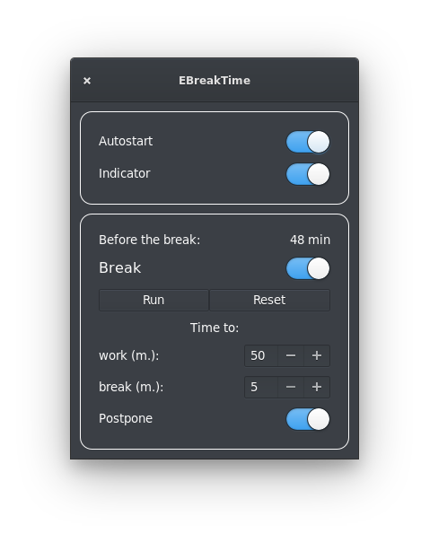
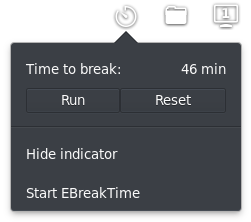

# EBreakTime

The application monitors the duration of the time spent for the PC. Periodically reminds you of the need to rest.

Features:
* ability to add to startup
* indicator visibility control
* opportunity to postpone the break

 

## Building and Installation

You'll need the following dependencies to build:
* valac
* libgtk-3-dev
* libglib2.0-dev
* libdbus-1-dev
* libnotify-dev
* libwingpanel-2.0-dev
* meson

### How To Build

    meson build --prefix=/usr
    ninja -C build
    sudo ninja -C build install
